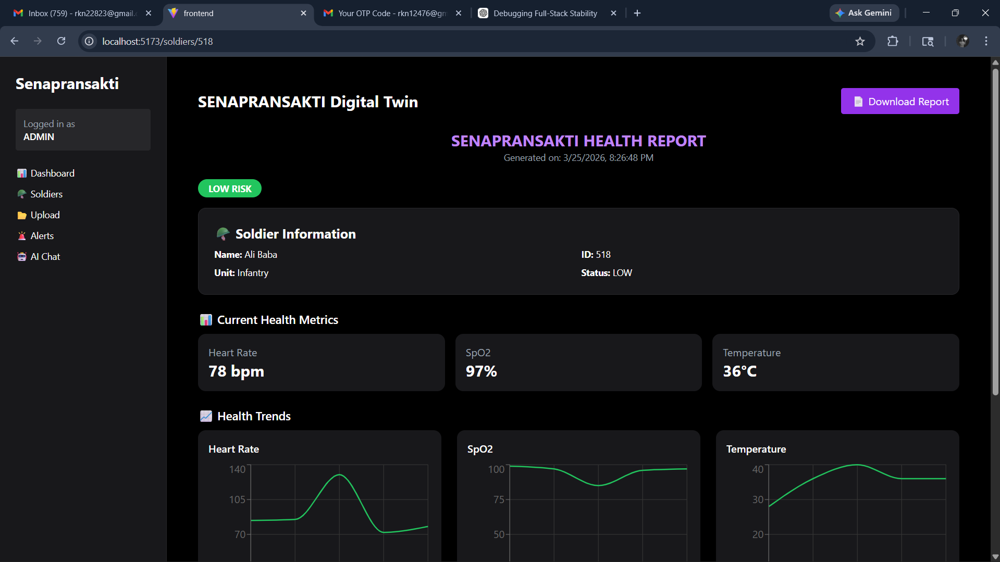

# Senapransakthi – AI-Driven Digital Twin System

## Overview

Senapransakthi is a full-stack AI-driven system designed to monitor, analyze, and manage soldier health and operational data in real time.
It integrates data ingestion, backend processing, and interactive dashboards to provide actionable insights and risk detection.

---

## Problem Statement

Monitoring large-scale personnel health data is complex and requires real-time decision-making.
Traditional systems lack intelligent analysis, centralized visibility, and automated alerting.

Senapransakthi addresses this by combining data pipelines, analytics, and AI-assisted insights into a single platform.

---

## Key Features

* 📊 **Command Dashboard** with real-time analytics and system overview
* 🧬 **Digital Twin System** for individual soldier health monitoring
* 🤖 **AI Assistant** for summaries and decision support
* 🚨 **Alert System** for detecting high-risk conditions
* 📁 **CSV Data Pipeline** for bulk data ingestion and processing
* 🔐 **Role-Based Access Control** (Admin / Medic)
* 📈 **Interactive Charts** for trends and risk distribution

---

## Screenshots

### Landing Page


### Command Dashboard


### AI Assistant


### Digital Twin View


### CSV Upload System


### Medic Control Panel


### Health Report



---

## Tech Stack

### Frontend

* React
* TypeScript
* Tailwind CSS

### Backend

* Node.js
* Express.js
* RESTful APIs

### Database

* PostgreSQL (Supabase)
* Drizzle ORM

### Other

* JWT Authentication
* CSV-based data processing
* AI integration (rule-based + API-driven insights)

---

## System Architecture

The application follows a modular full-stack architecture:

* **Frontend** → User interface and visualization
* **Backend** → API layer, business logic, authentication
* **Data Pipeline** → CSV ingestion and processing
* **Database** → Structured storage and retrieval
* **AI Layer** → Generates summaries and insights

---

## Project Structure

```bash
senapransakthi/
├── frontend/        # UI and client-side logic
├── backend/         # APIs, services, controllers
├── screenshots/     # Project visuals
└── README.md
```

---

## How AI Works

The AI component analyzes processed health data and system metrics to:

* Generate summaries of current system status
* Highlight high-risk conditions
* Provide decision-support insights via chat interface

(Current implementation uses structured data analysis and API-based responses.)

---

## Installation & Setup

### 1. Clone the repository

```bash
git clone https://github.com/rahul4018/senapransakthi.git
cd senapransakthi
```

### 2. Install dependencies

Frontend:

```bash
cd frontend
npm install
```

Backend:

```bash
cd ../backend
npm install
```

---

### 3. Environment Variables

Create a `.env` file in the backend:

```bash
PORT=5000
JWT_SECRET=your_secret_key
DATABASE_URL=your_database_url
```

---

### 4. Run the application

Backend:

```bash
npm run dev
```

Frontend:

```bash
npm run dev
```

---

## Future Improvements

* Deployment (Vercel / Render)
* Advanced ML model integration
* Real-time streaming data
* Performance optimization
* Enhanced UI/UX

---

## License

This project is licensed under the MIT License.
