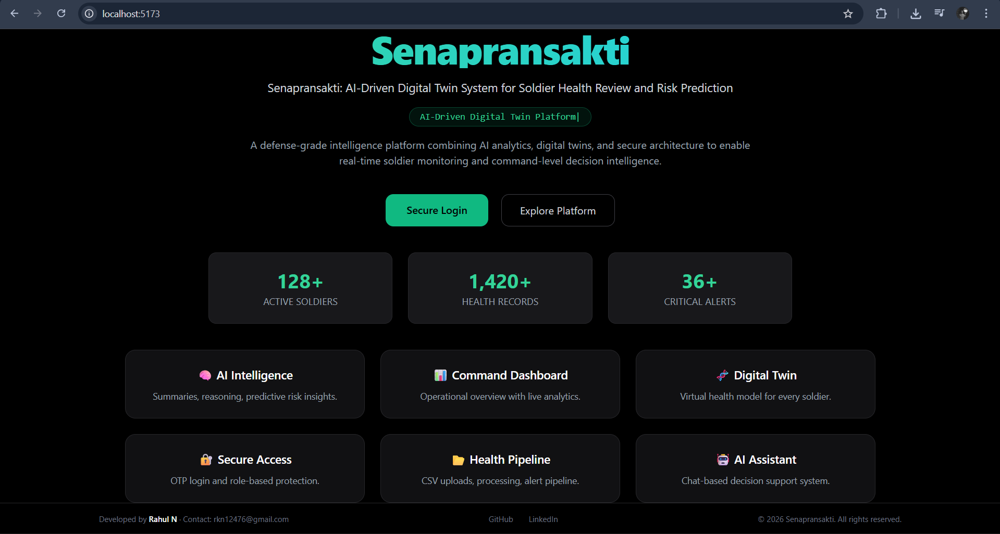
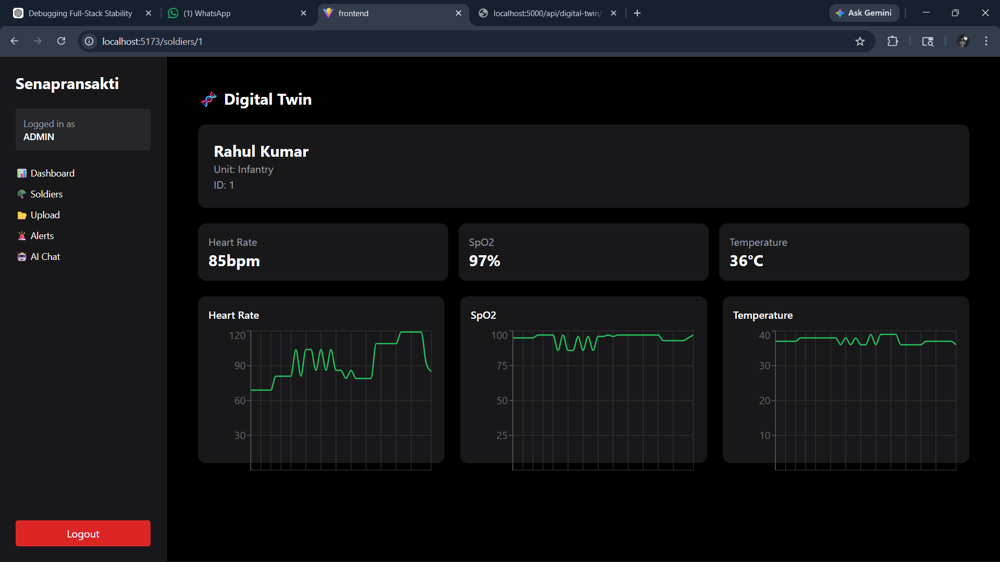
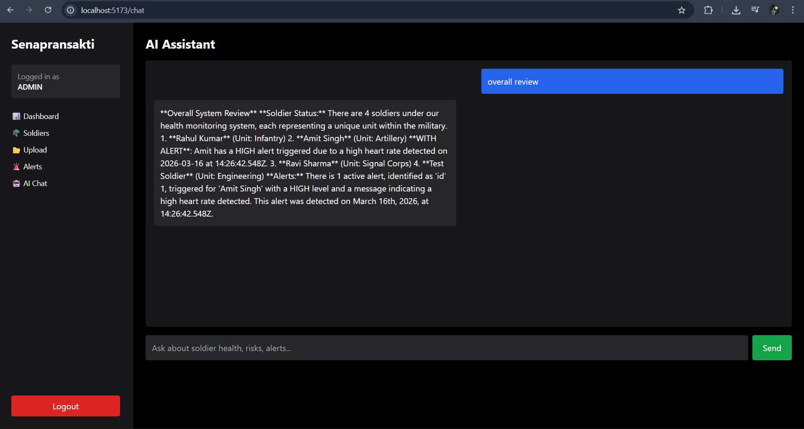
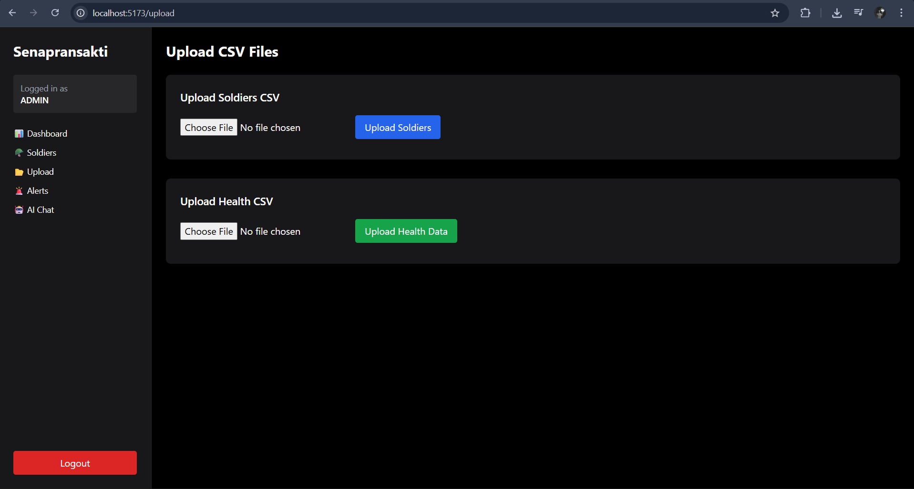
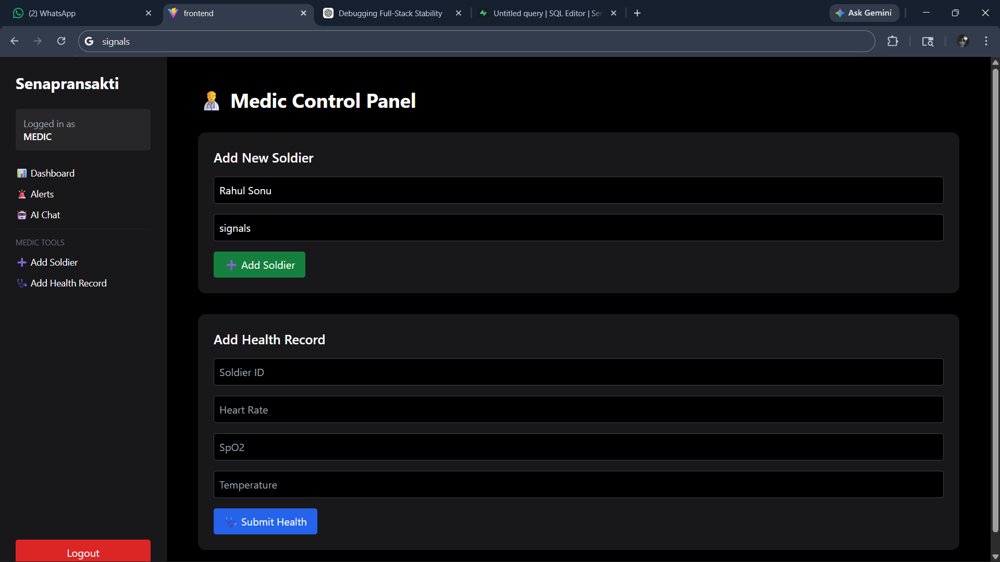

# Senapransakthi

> AI-driven digital twin system for real-time soldier health monitoring — data ingestion, risk detection, AI-assisted decision support, and a command-level SOC dashboard.

---

## Overview

Monitoring health data for large-scale military personnel is operationally complex. Traditional systems offer static dashboards with no intelligent analysis, no automated alerting, and no centralized visibility across units.

Senapransakthi solves this with a full-stack platform that ingests bulk personnel health data via CSV pipelines, processes it through an AI layer, and surfaces risk scores, anomalies, and decision-support insights to commanders and medics in real time — each soldier represented as a live digital twin.

---

## Screenshots

| Landing | Command Dashboard |
|---|---|
|  |  |

| Digital Twin View | AI Assistant |
|---|---|
|  |  |

| CSV Upload | Medic Control Panel |
|---|---|
|  |  |

---

## Features

**Command Dashboard**
Real-time unit-level analytics — risk distribution, alert counts, health trend charts, and system status overview across all soldiers.

**Digital Twin System**
Individual health profiles for each soldier, updated as new data arrives. Tracks vitals, historical trends, and computed risk scores over time.

**AI Assistant**
Chat interface that summarises current system state, surfaces high-risk conditions, and generates decision-support insights from processed health data.

**Alert System**
Automated flagging of high-risk readings with severity classification. Alerts routed by role — commanders see unit-level, medics see individual-level.

**CSV Data Pipeline**
Bulk data ingestion for large personnel datasets. Validates, parses, and processes uploaded files into structured records without manual entry.

**Role-Based Access Control**
Two roles: Admin (full access, system management) and Medic (individual soldier records, health reports, alert response). JWT-authenticated.

---

## Architecture

```
┌─────────────────────────────────────────┐
│           React + TypeScript UI          │
│                                         │
│  Command Dashboard · Digital Twin View  │
│  AI Chat · Medic Panel · CSV Upload     │
└──────────────────┬──────────────────────┘
                   │  REST API (JWT auth)
                   ▼
┌─────────────────────────────────────────┐
│         Node.js + Express Backend        │
│                                         │
│  Auth · Business logic · Controllers    │
│  CSV pipeline · Risk scoring            │
└──────────┬──────────────────┬───────────┘
           │                  │
           ▼                  ▼
┌──────────────────┐  ┌──────────────────┐
│  PostgreSQL       │  │   AI Layer       │
│  (Supabase)       │  │                  │
│  Drizzle ORM      │  │  Structured data │
│                  │  │  analysis +      │
│                  │  │  API-driven      │
│                  │  │  insights        │
└──────────────────┘  └──────────────────┘
```

---

## Tech Stack

| Layer | Technology |
|---|---|
| Frontend | React · TypeScript · Tailwind CSS |
| Backend | Node.js · Express.js |
| Database | PostgreSQL via Supabase · Drizzle ORM |
| Auth | JWT |
| Data ingestion | CSV pipeline (custom parser + validator) |
| AI | Rule-based analysis + external API integration |

---

## Getting Started

### Prerequisites

- Node.js 18+
- A [Supabase](https://supabase.com) project (free tier works)

### Clone and install

```bash
git clone https://github.com/rahul4018/senapransakthi.git
cd senapransakthi
```

```bash
# Install frontend dependencies
cd frontend && npm install

# Install backend dependencies
cd ../backend && npm install
```

### Environment variables

Create `backend/.env`:

```env
PORT=5000
JWT_SECRET=your_secret_key
DATABASE_URL=your_supabase_connection_string
```

### Run

```bash
# Terminal 1 — backend
cd backend && npm run dev

# Terminal 2 — frontend
cd frontend && npm run dev
```

Frontend → `http://localhost:5173`
Backend → `http://localhost:5000`

---

## Project Structure

```
senapransakthi/
├── frontend/
│   ├── src/
│   │   ├── components/     # UI components
│   │   ├── pages/          # Route-level views
│   │   ├── hooks/          # Custom React hooks
│   │   └── api/            # API client
│   └── package.json
├── backend/
│   ├── src/
│   │   ├── routes/         # Express route handlers
│   │   ├── controllers/    # Business logic
│   │   ├── services/       # AI layer, CSV pipeline, risk engine
│   │   ├── middleware/      # JWT auth, role guards
│   │   └── db/             # Drizzle schema + queries
│   └── package.json
├── screenshots/
└── README.md
```

---

## How the AI layer works

The AI component receives processed health records and computes:

1. **Risk scores** — derived from vitals thresholds, historical deviation, and anomaly flags
2. **Status summaries** — natural language summaries of current unit health state
3. **Decision-support responses** — chat interface queries routed through structured data analysis + an external LLM API for narrative generation

Current implementation is a hybrid: deterministic rules handle scoring and alerting; the external API handles free-text response generation.

---

## Roadmap

- [ ] Deploy frontend on Vercel + backend on Render
- [ ] Real-time streaming data (WebSockets or SSE)
- [ ] ML model integration for predictive risk scoring
- [ ] Audit log for all medic and admin actions
- [ ] PDF health report export per soldier

---

## License

MIT
